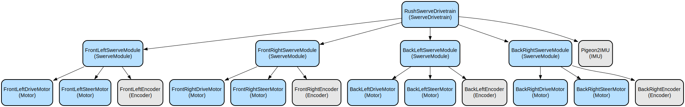

# Team RUSH 27 (2024 Code)

2024 Robot Code featuring swerve drive, autonomous path following, vision tracking, and automated game piece handling.

This codebase features:
- Advanced swerve drive control with field-centric and robot-centric modes
- Vision-based target tracking and autonomous alignment
- Automated game piece intake, indexing, and launching
- Path planning and autonomous navigation
- Comprehensive telemetry and diagnostics
- Support for both competition and practice robots

## Repository Structure
```
.
├── src/main/java/                      # Main source code directory
│   ├── com/team254/lib/               # Core libraries from Team 254
│   │   ├── control/                   # Control system components
│   │   ├── geometry/                  # Geometric calculations and transforms
│   │   ├── motion/                    # Motion profiling and path generation
│   │   ├── swerve/                    # Swerve drive kinematics and control
│   │   └── vision/                    # Vision processing utilities
│   └── net/teamrush27/frc2024/       # Team-specific robot code
│       ├── autonomous/                # Autonomous routines and commands
│       ├── controlboard/              # Driver interface and controls
│       ├── subsystems/               # Robot subsystems (drive, launcher, etc.)
│       └── util/                     # Utility classes
├── build.gradle                       # Gradle build configuration
└── vendordeps/                       # Third-party library dependencies
```

## Usage Instructions
### Prerequisites
- WPILib 2024.3.2 or later
- Java Development Kit (JDK) 17
- Phoenix 6 library for CTRE motor controllers
- REVLib for REV Robotics hardware
- PathPlanner library for autonomous path planning

### Installation
1. Clone the repository:
```bash
git clone <repository-url>
cd frc2024
```

2. Install dependencies:
```bash
./gradlew vendordep
```

3. Build the project:
```bash
./gradlew build
```

### Quick Start
1. Configure robot type in `Constants.java` (COMPETITION or PRACTICE)

2. Deploy to the robot:
```bash
./gradlew deploy
```

3. Basic operation:
- Driver controls use field-centric swerve drive by default
- Operator controls manage game piece handling and shooting
- Autonomous routines can be selected via SmartDashboard

### More Detailed Examples
1. Swerve Drive Control:
```java
// Field-centric drive
drivetrain.setWantedState(WantedState.FIELD_CENTRIC);
drivetrain.drive(xSpeed, ySpeed, rotation);

// Target tracking
drivetrain.setWantedState(WantedState.SPEAKER_ALIGN);
```

2. Game Piece Handling:
```java
// Intake and shoot sequence
supervisor.setWantedState(SupervisorWantedState.INTAKE);
supervisor.setLauncherShotType(ShotType.SPEAKER);
supervisor.setWantedState(SupervisorWantedState.FIRE);
```

### Troubleshooting
Common issues:
1. CAN Bus Communication Issues
   - Check Phoenix Tuner for device connectivity
   - Verify CAN IDs match configuration
   - Check CAN termination resistors

2. Swerve Module Calibration
   - Use Phoenix Tuner to verify encoder offsets
   - Check module alignment in robot characterization
   - Verify motor controller configurations

3. Vision Tracking Problems
   - Check camera exposure settings
   - Verify AprilTag positions in field configuration
   - Monitor network latency and packet loss

## Data Flow
The robot control system follows a hierarchical data flow architecture:

```ascii
Driver Input -> ControlBoard -> Subsystem Manager
     |              |               |
     v              v               v
Drivetrain <-> PoseEstimator <-> Vision
     |              |               |
     v              v               v
Motion Planning -> Supervisor -> Subsystems
```

Key interactions:
- ControlBoard processes driver inputs and maps to robot commands
- PoseEstimator fuses odometry and vision data for robot localization
- Supervisor coordinates subsystem states for game piece handling
- Drivetrain handles low-level motor control and kinematics
- Vision system provides target tracking and field localization

## Infrastructure


### Phoenix 6 Motor Controllers
- TalonFX drive motors (CAN IDs 10-17)
- CANcoder absolute encoders (CAN IDs 18-21)
- Pigeon2 IMU (CAN ID 3)

### REV Hardware
- SparkFlex controllers for auxiliary mechanisms
- Through-bore encoders for position feedback

### Network Communication
- CANFD bus for motor controllers
- Standard CAN for auxiliary devices
- NetworkTables for dashboard communication